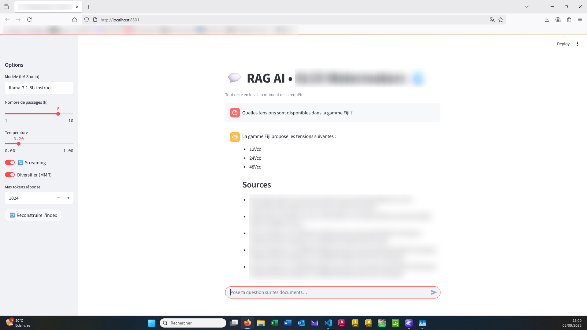

# 💬 RAG Local avec LM Studio

Ce projet met en place un **RAG (Retrieval-Augmented Generation)** 100% local sous Windows et macOS.

- [LM Studio](https://lmstudio.ai) → génération de texte (LLM local, API OpenAI-compatible)
- [ChromaDB](https://www.trychroma.com/) → indexation vectorielle
- [BAAI/bge-m3](https://huggingface.co/BAAI/bge-m3) → modèle d’embeddings multilingue (FR inclus)
- [Streamlit](https://streamlit.io/) → interface web type ChatGPT

👉 **Objectif** : poser des questions sur vos propres documents (.pdf, .docx, .txt, .xlsx) et obtenir des réponses sourcées.

Exemple d'utilisation : 



---

## 🤔 Qu’est-ce qu’un RAG ?

Un **RAG (Retrieval-Augmented Generation)** combine deux étapes :

1. **Retrieval** : recherche des passages pertinents dans vos documents, grâce à des embeddings stockés dans une base vectorielle.
2. **Augmented Generation** : le LLM génère une réponse en utilisant ces passages comme contexte.

➡️ Résultat : des réponses **fiables, contextualisées et locales**.

---

## ⚙️ Arborescence du projet
```bash
rag_lmstudio/
│── docs/ # Vos documents (peut contenir des sous-dossiers)
│── db/ # Base vectorielle locale (Chroma)
│── .env # Variables d'environnement (API LM Studio, modèle)
│── requirements.txt # Dépendances Python
│── utils_loaders.py # Fonctions de lecture des fichiers
│── build_index.py # Script d’indexation incrémentale
│── app.py # Interface web Streamlit (chat)
│── README.md # Documentation du projet
```
---


---

## 🚀 Installation

### 1. Pré-requis
- **Python 3.10+**
- [LM Studio](https://lmstudio.ai) installé
- **NVIDIA GPU** (CUDA) *ou* **Mac (MPS/CPU)** *ou* CPU seul

### 2. Installer les dépendances
```bash
pip install -r requirements.txt
```


(choisissez dans le fichier la bonne installation de PyTorch selon Windows/macOS)


### 3. Configurer LM Studio
- Ouvrir LM Studio
- Aller dans Developer → Local Server et cliquer sur Start
- Charger un modèle (ex. llama-3.1-8b-instruct)
- Vérifier qu’il apparaît dans la liste des modèles servis
- ⚠️ Décochez Allow local network access pour rester en localhost.


🔑 Configuration .env

Créez un fichier .env à la racine :

```Bash
OPENAI_BASE_URL=http://127.0.0.1:1234/v1
OPENAI_API_KEY=lm-studio
LMSTUDIO_MODEL=llama-3.1-8b-instruct   # nom exact du modèle dans LM Studio
```

📥 Indexation des documents

Déposez vos fichiers dans docs/ (les sous-dossiers sont pris en charge).
Lancez ensuite :

```Bash
python build_index.py
```
- Les documents sont découpés en chunks
- Les embeddings sont calculés (GPU si dispo → sinon MPS/CPU)
- La base vectorielle est sauvegardée dans db/

💬 Lancer l’interface
```Bash
streamlit run app.py
```

Une page web devrait s'ouvrir sinon : http://localhost:8501


Fonctionnalités :

- Interface style ChatGPT
- Réponses affichées en streaming
- Bouton 🔁 Reconstruire l’index
- Affichage des sources et passages utilisés


## Auteur

Arthur Prigent  
